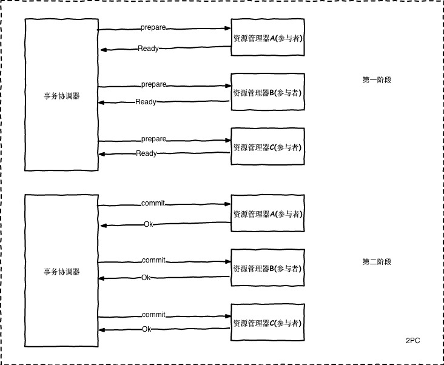
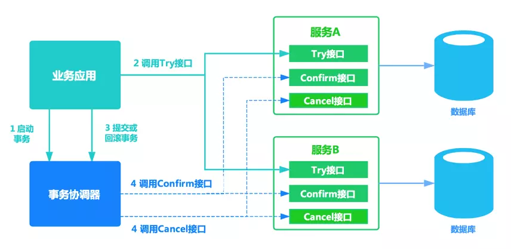
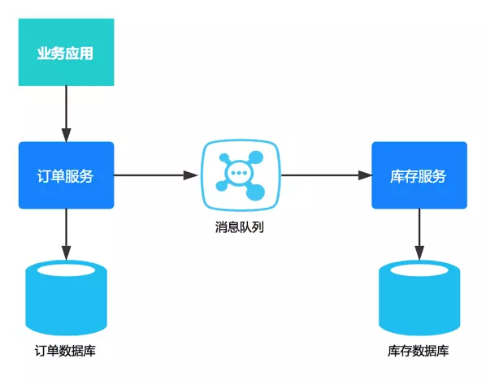

# 分布式事务
## 本地事务
单个数据库实例内的事务成为本地事务
### 事务的ACID特性
 - 原子性：事务中的一组操作全部执行或全不执行。通过redo和uno日志保证原子性
 - 一致性：
 - 隔离性：不同事务间相互隔离，通过锁保证事务隔离性
 - 持久性：事务变更后，持久存储

## 分布式事务
分布式事务由事务发起方、资源管理器(参与者)、全局事务协调器组成
### CAP定理
### BASE理论

## 分布式事务解决方案
### XA协议
XA : [XA](./distribute-transcation/DTP.pdf)是一个规范或是一个事务的协议.XA协议由Tuxedo首先提出的，并交给X/Open组织，作为资源管理器（数据库）与事务管理器的接口标准.
XA规范定义了:
- TransactionManager : TransactionManager可以通过管理多个ResourceManager来管理多个Resouce,也就是管理多个数据源
- XAResource : 针对数据资源封装的一个接口
- 两段式提交(2PC) : 多数据源事务提交的机制

### 两阶段提交(2pc)
两阶段提交是一个标准协议，并未规定如何具体实现。预提交 (PreCommit)和提交(Commit)两个阶段.
- 预提交阶段：事务发起方向事务协调器发起事务，事务协调器向所有参与者发起准备请求，参与者接受请求后执行本地事务但不提交。若所有参与者都在**超时时间内**向事务协调器返回成功，则进入第二阶段，否则事务协调器向所有参与者发起事务回滚请求，参与者执行本地事务回滚，分布式事务结束。
- 提交阶段：事务协调器向所有参与者发起提交请求，参与者接受请求后执行本地事务提交操作。若所有参与者返回成功，则分布式事务结束，否则进行事务补偿。

#### 缺点
- 同步阻塞问题，第一阶段参与者开启本地事务但并未提交，直到第二阶段执行结束后才会进行回滚或提交。期间本地事务一直开启，占用资源。不适合高并发场景。
- 单点故障，若协调器故障，则参与者会一直阻塞下去。尤其是在第二阶段故障，参与者持有资源但无法完成事务。如果是协调者挂掉，可以重新选举一个协调者，但是无法解决因为协调者宕机导致的参与者处于阻塞状态的问题
- 数据不一致风险：在第二阶段，协调器向所有参与者发送提交请求，若因为局部网络故障或发送过程中协调器宕机导致部分参与者未接收到提交请求。部分参与者执行了事务提交操作，另一部分未执行导致数据不一致。
- 二阶段无法解决的问题：协调者再发出提交消息之后宕机，而唯一接收到这条消息的参与者同时也宕机了。那么即使协调者通过选举协议产生了新的协调者，这条事务的状态也是不确定的，没人知道事务是否被已经提交。

### 三阶段提交(3pc)
三阶段提交是二阶段提交的改进版本，主要解决单点故障问题并减少阻塞。具体改进如下：
- 引入超时机制，事务协调器和资源管理器均引入超时机制 (2PC仅协调器存在超时机制)
- 增加准备阶段，保证事务提交前各个资源管理器状态一致。
分为CanCommit、PreCommit，DoCommit三个阶段。
- CanCommit: 事务协调器向资源管理器发送请求，是否可以进行事务提交。资源管理器收到请求后认为可以提交返回Yes，否则返回No
- PreCommit
- DoCommit

优点：不存在单点故障，阻塞范围小。
缺点： 脑裂问题，在PreCommit阶段，协调者发出请求后宕机，资源管理器会继续提交事务，造成不一致。

### 事务补偿TCC(Try-Confirme-Cancle)
TCC本质也是两阶段提交，在电商、金融等领域使用较多。将业务逻辑显示的划分为Try、Confirme、Cancle三个分支。Try阶段进行业务的准备，Confirme进行业务逻辑的提交、Cancle执行业务逻辑的回滚。
基本原理如下图所示：

事务开始时，业务应用会向事务协调器注册启动事务。之后业务应用会调用所有服务的try接口，完成一阶段准备。之后事务协调器会根据try接口返回情况，决定调用confirm接口或者cancel接口。如果接口调用失败，会进行重试。
#### 优点：
- 允许用户自定义锁粒度，降低锁冲突、提升并发成为可能。
#### 缺点：
- 业务侵入性强，对每个业务逻辑分支都要实现Try、Cancel、Confirme三个操作，应用侵入性强，改造成本高。
- 实现难度大，需要按照网络状态、系统故障等不同的原因实现不同的回滚策略。为满足一致性要求Cancel和Confirme接口必须实现幂等。微服务倡导服务的轻量化和易部署，而TCC中很多事务处理逻辑要求应用业务中实现，复杂且开发量大。

### 基于消息的最终一致性方案
基于消息系统中间件，保证上下游数据一致性。基本思路是将将本地操作和发送消息放在一个事务里做，保证本地事务和消息发送要么都成功，要么都失败。下游应用订阅消息进行消费。

本质上是将分布式事务转换为两个本地事务，通过下游重试达到最终一致性。基于消息的最终一致性方案对应用侵入性也很高，应用需要进行大量业务改造，成本较高。

参考文章：
[微服务架构下分布式事务解决方案 ](https://www.jianshu.com/p/eafdb65de40f)

